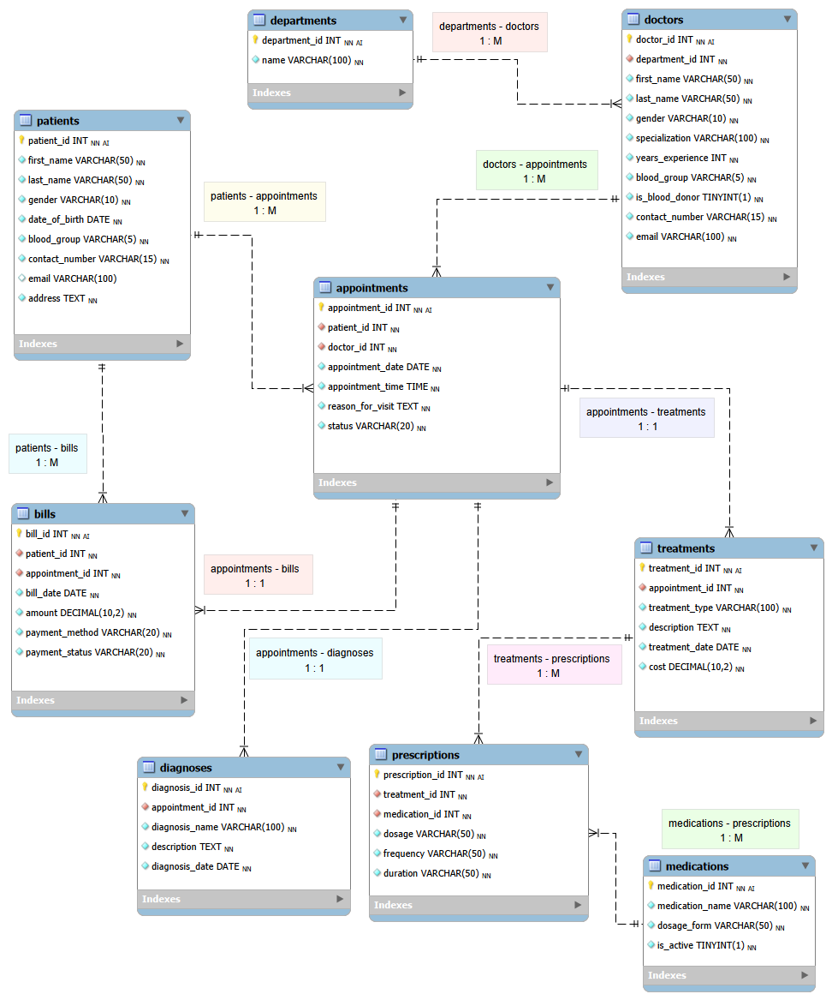

# Design Document

By: Kashish Baghel

Video overview: <https://youtu.be/EbZqOgX7ZiU?si=AhIslzL_GhYwXKwC>

## Scope

-------------------------Purpose of the database
The purpose of this database is to organize and store hospital records related to patient care, from appointments and diagnoses to treatments, prescriptions, and billing.

-------------------------Included in the scope
The database includes patients,doctors,hospital departments,appointments,treatments,diagnoses,medicines,prescriptions, and bills.

-------------------------Outside the scope
It does not include staff payroll,room allocation,laboratory reports,medical inventory, or insurance claims.

## Functional Requirements

--------------What should a user be able to do with your database?
A user can register patients, view doctor details,manage appointments,record diagnoses and treatments, issue prescriptions, and check billing and payment status.

--------------What's beyond the scope of what a user should be able to do with your database?
A user cannot delete records that are connected to other tables through foreign keys, in order to maintain past hospital records. The database also does not support medicine stock management or blood bank management.

## Representation

The database contains the following entities defined in schema.sql.

### Entities

### patients : patients table includes ;

`patient_id` - `Unique ID` for each patient. It is an `INTEGER` and the `PRIMARY KEY`, ensuring every patient has a unique record.
`first_name` - Patient's first name stored as `TEXT`. `NOT NULL` ensures every record has a name.
`last_name` - Patient's last name stored as `TEXT` with the `NOT NULL` constraint.
`gender` - Patient's gender stored as `TEXT`. A `CHECK` constraint limits the values to `M, F, or Other`.
`date_of_birth` - Patient's birth date stored as `TEXT` in `YYYY-MM-DD` format. It is required with `NOT NULL`.
`blood_group` - Patient's blood group stored as `TEXT`. A `CHECK` constraint allows only valid blood groups `(A+, A-, B+, B-, AB+, AB-, O+, O-)`.
`contact_number` - Patient's phone number stored as `TEXT`. The `NOT NULL` constraint ensures a contact number is always available.
`email` - Stores the patient's email address as `TEXT`. This field is optional because some patients may not have an email, and family members can share the same email address.
`address` - Residential address stored as `TEXT` with the `NOT NULL` constraint.

### departments : departments table includes ;

`department_id` - `Unique ID` for each department. It is an `INTEGER` and the `PRIMARY KEY`, ensuring every department has a unique record.
`name` - Name of the department stored as `TEXT`. The `NOT NULL` constraint makes it required, and the `UNIQUE` constraint prevents duplicate department names.

### doctors : doctors table includes ;

`doctor_id` - `Unique ID` for each doctor. It is stored as `INTEGER` and is the `PRIMARY KEY`, ensuring every doctor has a unique record.
`department_id` - Stores the department in which the doctor works as an `INTEGER`. It is a `FOREIGN KEY` that references `departments.department_id`, ensuring every doctor belongs to a valid department.
`first_name` - Doctor's first name stored as `TEXT`. The `NOT NULL` constraint makes this field mandatory.
`last_name` - Doctor's last name stored as `TEXT` with the `NOT NULL` constraint.
`gender` - Doctor's gender stored as `TEXT`. A `CHECK` constraint restricts the values to `M, F, or Other`.
`specialization` - Stores the doctor's medical specialization as `TEXT`. This field is required because every doctor practices in a specific specialty.
`years_experience` - Number of years of professional experience stored as `INTEGER`. A `CHECK (years_experience >= 0)` ensures negative values cannot be entered.
`blood_group` - Doctor's blood group stored as `TEXT`. A `CHECK` constraint allows only valid blood group values  `(A+, A-, B+, B-, AB+, AB-, O+, O-)`.
`is_blood_donor` - Indicates whether the doctor is a blood donor. It is stored as an `INTEGER`, where `0 = No and 1 = Yes`. A `CHECK (is_blood_donor IN (0,1))` ensures only these two values are accepted.
`contact_number` - Doctor's contact number stored as `TEXT`. The `UNIQUE` constraint prevents two doctors from sharing the same phone number.
`email` - Doctor's email address stored as `TEXT`. It is marked `UNIQUE` to ensure each doctor has a different email address.

### appointments : appointments table includes ;

`appointment_id` - `Unique ID` for each appointment. It is stored as `INTEGER` and is the `PRIMARY KEY`, ensuring every appointment has a unique record.
`patient_id` - Stores the ID of the patient as an `INTEGER`. It is a `FOREIGN KEY` that references `patients.patient_id`, ensuring every appointment belongs to an existing patient.
`doctor_id` - Stores the ID of the doctor as an `INTEGER`. It is a `FOREIGN KEY` that references `doctors.doctor_id`, ensuring every appointment is assigned to a valid doctor.
`appointment_date` - Stores the scheduled appointment date as `TEXT` in `YYYY-MM-DD` format. The `NOT NULL` constraint makes this field mandatory.
`appointment_time` - Stores the appointment time as `TEXT` in `HH:MM` format. It is required with the `NOT NULL` constraint.
`reason_for_visit` - Stores the patient's reason for visiting the hospital as `TEXT`. This helps identify the purpose of the appointment.
`status` - Stores the current appointment status as `TEXT`. A `CHECK`constraint allows only `Scheduled, Completed, or Cancelled`.

### diagnoses : diagnoses table includes ;

`diagnosis_id` - `Unique ID` for each diagnosis. It is stored as `INTEGER` and is the `PRIMARY KEY`, ensuring every diagnosis has a unique record.
`appointment_id` - Stores the related appointment ID as an `INTEGER`. It is a `FOREIGN KEY` that references `appointments.appointment_id` and is also marked `UNIQUE`, meaning one appointment can have only one diagnosis.
`diagnosis_name` - Stores the name of the diagnosed medical condition as `TEXT`. The `NOT NULL` constraint makes this field mandatory.
`description` - Stores additional details about the diagnosis as `TEXT`, such as examination findings or the patient's condition. This field is required.
`diagnosis_date` - Stores the date on which the diagnosis was made as `TEXT` in `YYYY-MM-DD` format. It is required with the `NOT NULL` constraint.

### treatments : treatments table includes ;

`treatment_id` - `Unique ID` for each treatment. It is stored as `INTEGER` and is the `PRIMARY KEY`, ensuring every treatment has a unique record.
`appointment_id` - Stores the related appointment ID as an `INTEGER`. It is a `FOREIGN KEY` that references `appointments.appointment_id` and is also marked `UNIQUE`, ensuring each appointment has only one treatment record.
`treatment_type` - Stores the category of treatment, such as Lifestyle Management, Radiation Therapy, or Root Canal Procedure, as `TEXT`. This field is required.
`description` - Stores detailed information about the treatment provided as `TEXT`. The `NOT NULL` constraint ensures the treatment details are recorded.
`treatment_date` - Stores the date the treatment was provided as `TEXT` in `YYYY-MM-DD` format. This field is mandatory.
`cost` - Stores the treatment cost as `REAL`. A `CHECK (cost >= 0)` constraint prevents negative treatment costs from being entered.

### medications : medications table includes ;

`medication_id` - `Unique ID` for each medicine. It is stored as `INTEGER` and is the `PRIMARY KEY`, ensuring every medicine has a unique record.
`medication_name` - Stores the name and strength of the medicine, such as `Amlodipine 5 mg or Paracetamol 500 mg`, as `TEXT`. The `UNIQUE` constraint prevents duplicate medicine entries.
`dosage_form` - Stores the form of the medicine, such as `Tablet, Capsule, Cream, Eye Drops, or Mouthwash`, as `TEXT`. The `NOT NULL` constraint ensures every medicine has a dosage form.

### prescriptions : prescriptions table includes ;

`prescription_id` - `Unique ID` for each prescription. It is stored as `INTEGER` and is the `PRIMARY KEY`, ensuring every prescription has a unique record.
`treatment_id` - Stores the related treatment ID as an `INTEGER`. It is a `FOREIGN KEY` referencing `treatments.treatment_id`, ensuring every prescription belongs to a valid treatment.
`medication_id` - Stores the prescribed medicine ID as an `INTEGER`. It is a `FOREIGN KEY` referencing `medications.medication_id`, ensuring only medicines in the medications table can be prescribed.
`dosage` - Stores the prescribed amount of medicine, such as `1 tablet or 2 drops`, as `TEXT`. This field is required.
`frequency` - Stores how often the medicine should be taken, such as `Once daily or Twice daily`, as `TEXT`. The `NOT NULL` constraint makes this field mandatory.
`duration` - Stores the length of the prescription, such as `7 days or 30 days`, as `TEXT`. This field is also required.

### bills : bills table includes ;

`bill_id` - `Unique ID` for each bill. It is stored as `INTEGER` and is the `PRIMARY KEY`, ensuring every bill has a unique record.
`patient_id` - Stores the ID of the patient as an `INTEGER`. It is a `FOREIGN KEY` referencing `patients.patient_id`, ensuring every bill belongs to a valid patient.
`appointment_id` - Stores the related appointment ID as an `INTEGER`. It is a `FOREIGN KEY` referencing `appointments.appointment_id` and is also marked `UNIQUE`, meaning one appointment can have only one bill.
`bill_date` - Stores the date the bill was generated as `TEXT` in `YYYY-MM-DD` format. This field is required.
`amount` - Stores the total bill amount as `REAL`. A `CHECK (amount >= 0)` constraint prevents negative billing amounts.
`payment_method` - Stores the method used for payment as `TEXT`. A CHECK constraint allows only `Cash, Card, UPI, or Insurance`.
`payment_status` - Stores the current payment status as `TEXT`. A `CHECK` constraint restricts the values to `Pending, Paid, or Overdue`.

---I used `INTEGER` for IDs and numeric values, `TEXT` for names, dates, addresses, and medical information, and `REAL` for monetary values such as treatment cost and bill amount. `TEXT` was also used for dates because SQLite stores dates in text format.

---`PRIMARY KEY` gives each record a unique ID. `FOREIGN KEY` connects related tables. `NOT NULL` makes sure important information is not left empty. `UNIQUE` prevents duplicate values, and `CHECK` allows only valid values such as gender, blood group, and payment status.

### Relationships

-------------------------Entity Relationships

The Hospital Management System has 9 tables connected using `Primary Keys (PK) and Foreign Keys (FK)`. These connections link related information, making the database organized and preventing duplicate data.

* Departments → Doctors (1:M)

A single department can have multiple doctors, while each doctor belongs to only one department.
`Primary Key: departments.department_id`
`Foreign Key: doctors.department_id`
The department_id stored in the doctors table references the primary key of the departments table.

* Patients → Appointments (1:M)

A patient may schedule multiple appointments during different visits, but each appointment belongs to one patient.
`Primary Key: patients.patient_id`
`Foreign Key: appointments.patient_id`
The patient_id in appointments identifies which patient booked that appointment.

* Doctors → Appointments (1:M)

A doctor can attend many appointments, whereas each appointment is assigned to only one doctor.
`Primary Key: doctors.doctor_id`
`Foreign Key: appointments.doctor_id`
This relationship links every appointment with its assigned doctor.

* Appointments → Diagnoses (1:1)

Each completed appointment has one diagnosis record, and every diagnosis belongs to one appointment.
`Primary Key: appointments.appointment_id`
`Foreign Key: diagnoses.appointment_id`
The unique appointment_id in diagnoses ensures that one appointment cannot have multiple diagnosis records.

* Appointments → Treatments (1:1)

Every appointment is associated with one treatment record describing the medical care provided.
`Primary Key: appointments.appointment_id`
`Foreign Key: treatments.appointment_id`
The appointment_id uniquely connects each treatment to its appointment.

* Treatments → Prescriptions (1:M)

A single treatment may require multiple prescribed medicines, but each prescription belongs to one treatment.
`Primary Key: treatments.treatment_id`
`Foreign Key: prescriptions.treatment_id`
This allows multiple medications to be prescribed after one treatment.

* Medications → Prescriptions (1:M)

One medication can appear in many different prescriptions, while each prescription references one medication.
`Primary Key: medications.medication_id`
`Foreign Key: prescriptions.medication_id`
This prevents duplicate medication information from being stored repeatedly.

* Patients → Bills (1:M)

A patient may receive multiple bills for different hospital visits, but each bill belongs to one patient.
`Primary Key: patients.patient_id`
`Foreign Key: bills.patient_id`
The `patient_id` in bills identifies the patient responsible for that bill.

* Appointments → Bills (1:1)

Each appointment generates one billing record, and every bill corresponds to one appointment.
`Primary Key: appointments.appointment_id`
`Foreign Key: bills.appointment_id`
The unique `appointment_id` in bills ensures that only one bill is created for each appointment.

## Optimizations

* Which optimizations (e.g., indexes, views) did you create? Why?

------------------------`View: patient_medical_history`--------------------------
This view was created because doctors and hospital staff frequently need a patient's complete medical history. It combines data from patients, appointments, doctors, diagnoses, treatments, prescriptions, and medications into a single virtual table, making retrieval simpler and more efficient.

------------------------`Index: idx_appointments_doctor`--------------------------
This index was created because searching a doctor's daily schedule is one of the most common operations in a hospital. Indexing doctor_id and appointment_date makes these searches faster.

------------------------`Index: idx_appointments_patient`--------------------------
This index improves the speed of retrieving all appointments for a particular patient, which is frequently required when viewing patient history.

------------------------`Index: idx_bills_payment_status`--------------------------
Hospital staff often filter bills by Paid, Pending, or Overdue status. This index speeds up billing and payment-related queries

## Limitations

* No patient admission or room management: The database does not store information about patient admissions, hospital rooms, bed allocation, or discharge details.
* Limited staff information: Only doctors are included; nurses, receptionists, pharmacists, and other hospital staff are not represented.
* No laboratory or diagnostic test records: Blood tests, X-rays, MRI scans, and other test results are not stored.
* No inventory management: The database does not track medicine stock, medical equipment, or pharmacy inventory.
